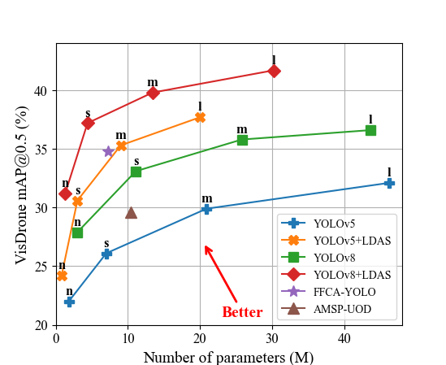

# A Dynamic Context-aware Aggregation Strategy for Small Object Detection

<div align=center>

</div>


## <div align="center">Documentation</div>

### Benchmark
| **Model**     | **Datasets** |  **mAP@0.5<sup>val**  | **mAP@0.5:0.95<sup>val** | **Params** | **Weight**                                                                                           |
|:-------------:|:------------:|:---------------------:|:------------------------:|:----------:|:----------------------------------------------------------------------------------------------------:|
| YOLOv8l       | VisDrone     |         36.6%         |          21.6%           | 43.6M      | [Google Drive](https://drive.google.com/file/d/1Gn_dKNh2g1zhuFy5NB9NFegY1Jq1nhcT/view?usp=sharing) |
| YOLOv8l+DCAS  | VisDrone     |         41.7%         |          24.5%           | 30.2M      | [Google Drive](https://drive.google.com/file/d/19EnOAzVGygZqLh1P3biI8zRkpZTn5Mo4/view?usp=sharing) |
| YOLOv8l       | BDD100K      |         58.6%         |          34.7%           | 43.6M      | [Google Drive](https://drive.google.com/file/d/1IGCzLTKE4y624RQ6VE4qDMetc0_GaOnm/view?usp=sharing) |
| YOLOv8l+DCAS  | BDD100K      |         61.7%         |          36.8%           | 29.7M      | [Google Drive](https://drive.google.com/file/d/1_ZXuC-PJXCoCNyAZ1_gNrvXqvcVtEhgt/view?usp=sharing) |
| YOLOv8l       | TT100K       |         89.9%         |          70.1%           | 43.6M      | [Google Drive](https://drive.google.com/file/d/1gJnBMX0Jvy1sPaLIKA3IA73lnLlalay_/view?usp=sharing) |
| YOLOv8l+DCAS  | TT100K       |         94.9%         |          74.6%           | 29.9M      | [Google Drive](https://drive.google.com/file/d/1SWKY_vE5Vrt4ttxZJXFyGS5zBqqeR2SE/view?usp=sharing) |

Table Notes
- No pre-trained weights were used during training.
- The input image resolution is 640×640.
- The training batch size is 16, with a total of 300 training epochs.
- All other parameters follow the settings of the baseline model.

### Quick Start
<details open>
<summary>Install</summary>

Clone repository and install [requirements.txt](./requirements.txt) in a [**Python==3.10**](https://www.python.org/) environment, 
including [**PyTorch==2.0.1**](https://pytorch.org/get-started/previous-versions/) and [**CUDA==11.7**](https://pytorch.org/get-started/previous-versions/).
```bash
git clone https://github.com/crafly/DCAS.git  # Clone the DCAS repository
cd DCAS  # Navigate to the cloned directory
pip install -e .  # Install the package in editable mode for development
```
</details>

<details open>
<summary>Training</summary>
The commands below reproduce DCAS training results.

```bash
yolo task=detect mode=train model=yolov8l+DCAS.yaml data=VisDrone.yaml epochs=300 batch=16 device=0
```

For the scene-guided fusion model introduced in this repo update, use:

```bash
python tools/run_visdrone_scene_dcas.py --profile full --device 0
```

This default command keeps the parallel scene branch and feature fusion active, but disables the auxiliary
`Scene Loss` so you can first evaluate whether the structure itself helps detection.

To enable scene supervision later, turn it on explicitly:

```bash
python tools/run_visdrone_scene_dcas.py --profile full --device 0 --scene-supervision true --scene 0.1
```

The current `yolov8+SCDDCAS.yaml` uses multi-scale scene fusion instead of a single global scene gate:

```yaml
scene_fusion:
  - [7, 3]   # deepest backbone context
  - [11, 3]  # deep neck fusion
  - [15, 2]  # medium-resolution fusion
  - [19, 1]  # small-object branch
  - [22, 2]  # medium-object branch
  - [25, 3]  # large-object branch
```

Each pair means `[detection_layer_index, scene_feature_stage]`, so scene semantics now modulate the DCAS pipeline with
both a global embedding and a spatial scene feature map.

Optional scene supervision can be added to the dataset yaml with:

```yaml
scene_names: [city, suburb, port, highway]
scene_labels: scene_labels.txt
```

Each line in `scene_labels.txt` should map an image to a scene id or scene name, for example:

```text
images/train/000001.jpg,0
images/train/000002.jpg,port
```

If your dataset is organized by scene folders or you already have a csv/json mapping, you can generate the file with:

```bash
python tools/build_scene_labels.py --data path/to/data.yaml --mode folder --parent-level 1
python tools/build_scene_labels.py --data path/to/data.yaml --mode csv --source path/to/scene_labels.csv
python tools/build_scene_labels.py --data path/to/data.yaml --mode pseudo --clusters 8
```

The script prints the discovered `scene_names` list, and can also write a yaml snippet with:

```bash
python tools/build_scene_labels.py --data path/to/data.yaml --mode folder --scene-names-out path/to/scene_meta.yaml
```

For a quick end-to-end smoke test on a tiny VisDrone subset, use:

```bash
python tools/run_visdrone_scene_dcas.py --profile smoke
```

The scene-guided training entrypoint intentionally lowers `mosaic` from the YOLO default. With `mosaic=1.0`,
the dataloader replaces `scene_cls` with `-1`, so the auxiliary scene supervision becomes ineffective.
</details>

<details open>
<summary>Evaluation</summary>
The commands below reproduce DCAS evaluation results.

```bash
yolo task=detect mode=val model=weights/best.pt data=VisDrone.yaml batch=16 device=0
```
</details>

<details open>
<summary>Inference</summary>

The commands below reproduce DCAS inference results.

```bash
yolo task=detect mode=predict model=weights/best.pt device=0 source=path/to/image.jpg  # image
                                                                    path/to/video.mp4  # video
                                                                    path/to/dir  # directory
```
</details>

### Implementation details
Please note
- The overall architecture of DCAS is located at `DCAS/ultralytics/models/v8/yolov8+DCAS.yaml`.
- The DAM module is located at `DCAS/ultralytics/nn/modules.py` and calls `DCAS/ultralytics/nn/DAM.py`.
- The dataset paths in `DCAS/ultralytics/nn/DAM.py` and `DCAS/ultralytics/datasets/` need to be changed to the root directory where the datasets are stored.
- The configuration file is located at `DCAS/ultralytics/yolo/cfg/default.yaml`.
- Representative images of small objects are located at `DCAS/ultralytics/assets/small_object/`.

### Data download
Note that all data has been cleaned and converted to YOLO format labels.
- VisDrone (1.81 GB): [GoogleDrive](https://drive.google.com/file/d/18rZfHuRK40nH43iVbLOd95h6Yv6BoKKl/view?usp=sharing)
- BDD100K (4.25 GB): [GoogleDrive](https://drive.google.com/file/d/1-ghEyaWKQ1lna4kcxXrUKfAAZygpMlh0/view?usp=sharing)
- TT100K (8.74 GB): [GoogleDrive](https://drive.google.com/file/d/10V2pUSmd6nzD5Cs9o0E_4IUfRjVYr6RK/view?usp=sharing)

## Acknowledgement
The code implementation is based on [YOLOv8](https://github.com/ultralytics/ultralytics), thanks to their open-source code.
The data is based on the [VisDrone](https://github.com/VisDrone/VisDrone-Dataset), [BDD100K](https://www.vis.xyz/bdd100k/), and [TT100K](https://cg.cs.tsinghua.edu.cn/traffic-sign/) datasets, thanks to their open-source data.
