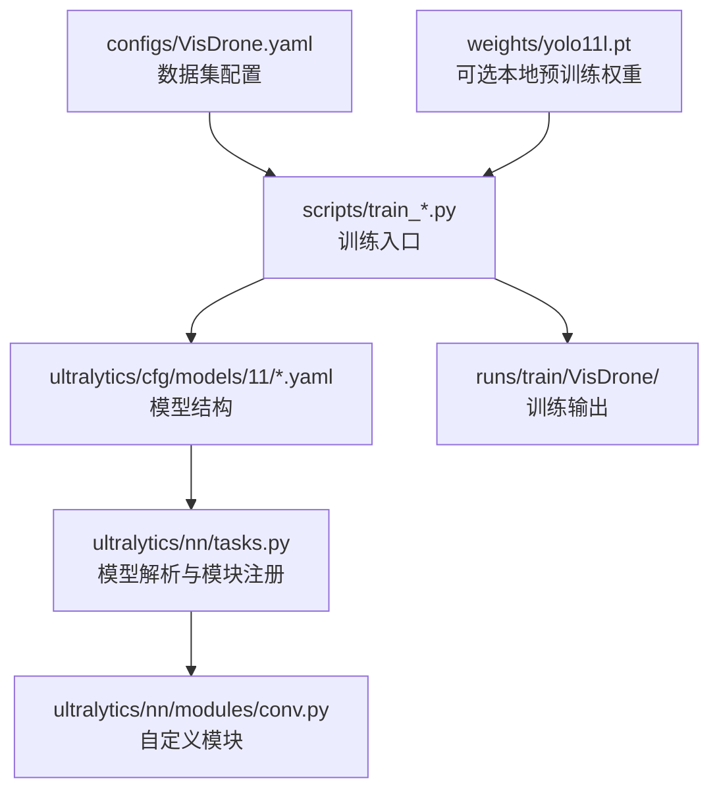

# YOLOv11-VisDrone

一个面向 VisDrone 小目标检测的 YOLO11 实验仓库。

当前主线是 **HSCR-YOLO**（High-level Semantic Context Retention YOLO），核心思路是保留 P5 语义上下文，但最终只在 P2 / P3 / P4 上做检测，兼顾小目标效果和训练效率。

## 1. 项目概述

本项目用于在 VisDrone 数据集上做小目标检测实验，重点关注：

- 提升密集小目标的召回和定位质量
- 优先优化 `mAP50`
- 控制训练时长和显存开销
- 保留清晰的消融路径，便于后续论文写作和结果对比

当前仓库保留了多个实验分支，包括纯 YOLO11l、P2、RFCG 和 HSCR 等版本，便于回溯和对照。

## 2. 技术栈

- Python
- PyTorch
- Ultralytics YOLO
- OpenCV
- NumPy
- PyYAML

## 3. 项目架构



数据流可以理解为：

`数据集配置 -> 模型 YAML -> 训练脚本 -> Ultralytics 训练器 -> 结果输出`

## 4. 目录结构

```text
YOLOv11-VisDrone/
  configs/
    VisDrone.yaml
  scripts/
    train_yolo11l_visdrone.py
    train_yolo11l_p2_visdrone.py
    train_yolo11l_p2_rfcg_visdrone.py
    train_yolo11l_hscr_visdrone.py
    val_yolo11l_visdrone.py
  ultralytics/
    cfg/models/11/
      yolo11.yaml
      yolo11l-p2.yaml
      yolo11l-p2-rfcg.yaml
      yolo11l-hscr.yaml
    nn/
      tasks.py
      modules/conv.py
  weights/
    .gitkeep
  requirements.txt
  .gitignore
  README.md
```

说明：

- `runs/` 是训练输出目录，不纳入版本控制
- `weights/*.pt` 是本地预训练或实验权重，不纳入版本控制
- `.agents/`、`.codex/`、`.idea/`、`.ipynb_checkpoints/` 等都是本机工作区缓存，也不会提交

## 5. 核心文件说明

### 5.1 项目入口与配置

- [configs/VisDrone.yaml](configs/VisDrone.yaml)
  - 数据集路径和类别定义
  - 需要在服务器上把 `path` 改成实际数据集根目录

- [scripts/train_yolo11l_visdrone.py](scripts/train_yolo11l_visdrone.py)
  - 纯 YOLO11l 训练入口

- [scripts/train_yolo11l_p2_visdrone.py](scripts/train_yolo11l_p2_visdrone.py)
  - P2 小目标基线训练入口

- [scripts/train_yolo11l_p2_rfcg_visdrone.py](scripts/train_yolo11l_p2_rfcg_visdrone.py)
  - RFCG 消融实验入口

- [scripts/train_yolo11l_hscr_visdrone.py](scripts/train_yolo11l_hscr_visdrone.py)
  - 当前主线实验入口

- [scripts/val_yolo11l_visdrone.py](scripts/val_yolo11l_visdrone.py)
  - 统一验证入口

### 5.2 模型结构文件

- [ultralytics/cfg/models/11/yolo11.yaml](ultralytics/cfg/models/11/yolo11.yaml)
  - 官方 YOLO11 检测结构配置；纯 YOLO11l 训练脚本默认使用 `yolo11l.pt`

- [ultralytics/cfg/models/11/yolo11l-p2.yaml](ultralytics/cfg/models/11/yolo11l-p2.yaml)
  - 加入 P2 检测头的版本

- [ultralytics/cfg/models/11/yolo11l-p2-rfcg.yaml](ultralytics/cfg/models/11/yolo11l-p2-rfcg.yaml)
  - 在 P2 路径上加入 RFCG 的实验版本

- [ultralytics/cfg/models/11/yolo11l-hscr.yaml](ultralytics/cfg/models/11/yolo11l-hscr.yaml)
  - 当前主线 HSCR-YOLO
  - 保留 P5 语义上下文，检测层为 P2 / P3 / P4

### 5.3 核心实现

- [ultralytics/nn/modules/conv.py](ultralytics/nn/modules/conv.py)
  - 自定义模块实现位置
  - 当前包含 `CBAM`、`RFCG` 等模块

- [ultralytics/nn/tasks.py](ultralytics/nn/tasks.py)
  - 模型构建、模块注册和结构解析
  - 如果要新增模块，通常需要先在这里接入

## 6. 使用方法

### 6.1 安装依赖

```bash
pip install -r requirements.txt
```

### 6.2 准备数据集

把 `configs/VisDrone.yaml` 里的 `path` 改成你本机或服务器上的 VisDrone 数据集根目录。

### 6.3 训练

纯 YOLO11l：

```bash
python scripts/train_yolo11l_visdrone.py --device 0
```

P2 基线：

```bash
python scripts/train_yolo11l_p2_visdrone.py --device 0
```

当前主线 HSCR：

```bash
python scripts/train_yolo11l_hscr_visdrone.py --device 0
```

如果本地有 `weights/yolo11l.pt`，脚本会优先使用；没有的话会自动走 Ultralytics 的默认预训练加载方式。

### 6.4 验证

```bash
python scripts/val_yolo11l_visdrone.py --device 0
```

## 7. 仓库约定

- 只提交代码、配置和文档
- 不提交训练结果、预训练权重和缓存目录
- 后续新增模块时，优先改 `ultralytics/nn/modules/conv.py` 和 `ultralytics/nn/tasks.py`
- 新实验尽量保持一个脚本对应一个结构，方便做消融对比
