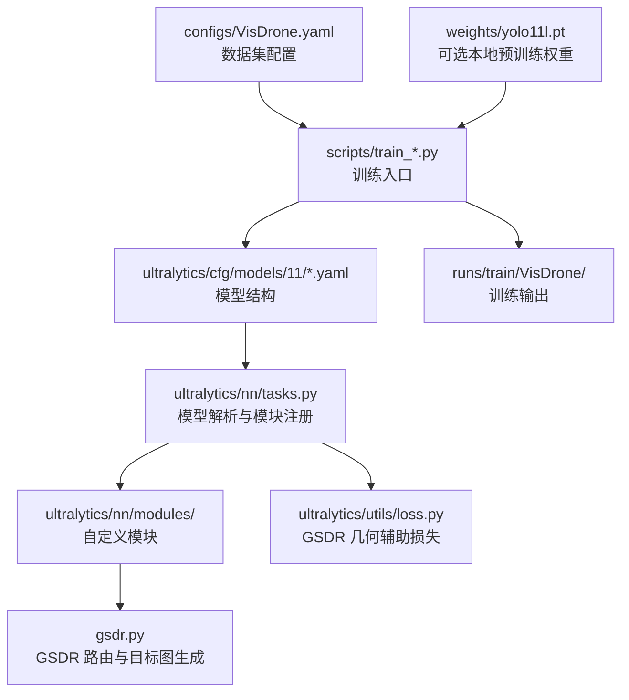

# YOLOv11-VisDrone

一个面向 VisDrone 小目标检测的 YOLO11 实验仓库。

当前基线是 **HSCR-YOLO**（High-level Semantic Context Retention YOLO），核心思路是保留 P5 语义上下文，但最终只在 P2 / P3 / P4 上做检测，兼顾小目标效果和训练效率。

仓库新增了待验证的 **GSDR-YOLO**（Geometry-Supervised Dual Routing YOLO）实验分支：在 HSCR 的 P2 / P3 / P4 检测特征前加入几何监督的尺度-密度双路由模块。该分支尚未产生正式训练结果，HSCR 仍是当前对照基线。

## 1. 项目概述

本项目用于在 VisDrone 数据集上做小目标检测实验，重点关注：

- 提升密集小目标的召回和定位质量
- 优先优化 `mAP50`
- 控制训练时长和显存开销
- 保留清晰的消融路径，便于后续论文写作和结果对比

当前仓库保留了多个实验分支，包括纯 YOLO11l、P2、RFCG、HSCR 和 GSDR 等版本，便于回溯和对照。

### GSDR 核心机制

GSDR 先利用 P2 预测局部密度图与尺度图，再按以下顺序处理最终检测特征：

1. 密度路由选择小、中、大三种局部观察范围，密集区域偏向较小范围。
2. 尺度路由在相邻特征层间分配信息，小目标偏向 P2，较大目标增加 P3/P4 比例。
3. 路由结果以残差方式加入原 P2/P3/P4 特征，再送入 Detect。

核心特征更新可写为：

\[
F'_l = F_l + \alpha \sum_{j\in\mathcal{N}(l)} \pi_{l\leftarrow j}(\hat{s})
\mathcal{A}_{j\rightarrow l}\left(\sum_k \beta_k(\hat{d})\mathcal{C}_k(F_j)\right)
\]

其中，\(\hat{s}\) 为预测尺度，\(\hat{d}\) 为预测密度，\(\pi\) 是跨层路由权重，\(\beta\) 是观察范围权重。训练时在原检测损失外增加密度和尺度辅助损失，但不新增分类损失。

## 2. 技术栈

- Python
- PyTorch
- Ultralytics YOLO
- OpenCV
- NumPy
- PyYAML

## 3. 项目架构



数据流可以理解为：

`数据集配置 -> 模型 YAML -> 训练脚本 -> Ultralytics 训练器 -> 结果输出`

## 4. 目录结构

```text
YOLOv11-VisDrone/
  configs/
    VisDrone.yaml
  scripts/
    train_yolo11l_visdrone.py
    train_yolo11l_p2_visdrone.py
    train_yolo11l_p2_rfcg_visdrone.py
    train_yolo11l_hscr_visdrone.py
    train_yolo11l_gsdr_visdrone.py
    val_yolo11l_visdrone.py
  ultralytics/
    cfg/models/11/
      yolo11.yaml
      yolo11l-p2.yaml
      yolo11l-p2-rfcg.yaml
      yolo11l-hscr.yaml
      yolo11l-gsdr.yaml
    nn/
      tasks.py
      modules/conv.py
      modules/gsdr.py
  tests/
    test_gsdr.py
  weights/
    .gitkeep
  requirements.txt
  .gitignore
  README.md
```

说明：

- `runs/` 是训练输出目录，不纳入版本控制
- `weights/*.pt` 是本地预训练或实验权重，不纳入版本控制
- `.agents/`、`.codex/`、`.idea/`、`.ipynb_checkpoints/` 等都是本机工作区缓存，也不会提交

## 5. 核心文件说明

### 5.1 项目入口与配置

- [configs/VisDrone.yaml](configs/VisDrone.yaml)
  - 数据集路径和类别定义
  - 需要在服务器上把 `path` 改成实际数据集根目录

- [scripts/train_yolo11l_visdrone.py](scripts/train_yolo11l_visdrone.py)
  - 纯 YOLO11l 训练入口

- [scripts/train_yolo11l_p2_visdrone.py](scripts/train_yolo11l_p2_visdrone.py)
  - P2 小目标基线训练入口

- [scripts/train_yolo11l_p2_rfcg_visdrone.py](scripts/train_yolo11l_p2_rfcg_visdrone.py)
  - RFCG 消融实验入口

- [scripts/train_yolo11l_hscr_visdrone.py](scripts/train_yolo11l_hscr_visdrone.py)
  - 当前主线实验入口

- [scripts/train_yolo11l_gsdr_visdrone.py](scripts/train_yolo11l_gsdr_visdrone.py)
  - GSDR-YOLO 实验入口
  - 默认使用 v4 均匀路由消融，`imgsz=640`、`batch=8`，按 `mAP50-95` 保存最佳权重，与已完成的 HSCR-640 对齐

- [scripts/val_yolo11l_visdrone.py](scripts/val_yolo11l_visdrone.py)
  - 统一验证入口

### 5.2 模型结构文件

- [ultralytics/cfg/models/11/yolo11.yaml](ultralytics/cfg/models/11/yolo11.yaml)
  - 官方 YOLO11 检测结构配置；纯 YOLO11l 训练脚本默认使用 `yolo11l.pt`

- [ultralytics/cfg/models/11/yolo11l-p2.yaml](ultralytics/cfg/models/11/yolo11l-p2.yaml)
  - 加入 P2 检测头的版本

- [ultralytics/cfg/models/11/yolo11l-p2-rfcg.yaml](ultralytics/cfg/models/11/yolo11l-p2-rfcg.yaml)
  - 在 P2 路径上加入 RFCG 的实验版本

- [ultralytics/cfg/models/11/yolo11l-hscr.yaml](ultralytics/cfg/models/11/yolo11l-hscr.yaml)
  - 当前主线 HSCR-YOLO
  - 保留 P5 语义上下文，检测层为 P2 / P3 / P4

- [ultralytics/cfg/models/11/yolo11l-gsdr.yaml](ultralytics/cfg/models/11/yolo11l-gsdr.yaml)
  - HSCR-YOLO 上的 GSDR 消融结构
  - GSDR 同时接收最终 P2 / P3 / P4 特征，再交给 Detect

### 5.3 核心实现

- [ultralytics/nn/modules/conv.py](ultralytics/nn/modules/conv.py)
  - 自定义模块实现位置
  - 当前包含 `CBAM`、`RFCG` 等模块

- [ultralytics/nn/modules/gsdr.py](ultralytics/nn/modules/gsdr.py)
  - `GSDR` 模块实现
  - 使用 P2 预测密度图和尺度图
  - 密度选择局部观察范围，尺度选择 P2 / P3 / P4 的相邻层融合比例
  - 含 VisDrone 标注统计初始化的有序路由中心和几何目标图生成器

- [ultralytics/utils/loss.py](ultralytics/utils/loss.py)
  - `GSDRDetectionLoss` 在原检测损失上增加密度损失和尺度损失
  - 不增加额外分类损失

- [ultralytics/nn/tasks.py](ultralytics/nn/tasks.py)
  - 模型构建、模块注册和结构解析
  - 如果要新增模块，通常需要先在这里接入

## 6. 使用方法

### 6.1 安装依赖

```bash
pip install -r requirements.txt
```

### 6.2 准备数据集

把 `configs/VisDrone.yaml` 里的 `path` 改成你本机或服务器上的 VisDrone 数据集根目录。

### 6.3 训练

纯 YOLO11l：

```bash
python scripts/train_yolo11l_visdrone.py --device 0
```

P2 基线：

```bash
python scripts/train_yolo11l_p2_visdrone.py --device 0
```

当前主线 HSCR：

```bash
python scripts/train_yolo11l_hscr_visdrone.py --device 0
```

GSDR-YOLO：

```bash
python scripts/train_yolo11l_gsdr_visdrone.py --device 0
```

后续训练和验证统一使用 `imgsz=640`。已完成的 HSCR-640 实际使用 `batch=8`，其最佳权重 mAP50 为 0.40748、mAP50-95 为 0.23748。HSCR/GSDR 入口默认 `batch=8`、`seed=0`，按 `mAP50-95` 选择最佳权重及早停。旧 832 结果仅作历史参考，不能用于这组模块增益对照。

现在先跑 GSDR v4 均匀路由，再跑 v4 动态路由，与已有 HSCR 对照。GSDR 默认入口已切换到均匀路由；v6 配置保留供历史复现，不安排重跑。显式命令及判定标准见 [GSDR_ABLATION.md](GSDR_ABLATION.md)。记录辅助损失、训练时间和显存变化。P2/P2-RFCG 旧入口只统一了分辨率，若加入正式对照还需显式统一 batch 等设置。

已有 YOLO11l-640 使用 `batch=16`，入口保留该默认值。这组结果暂作历史参考，不要求现在重跑；与 batch=8 的 HSCR 比较不能隔离 batch 的影响。候选模块通过筛选后，再补同 batch 的 YOLO11l 对照及重复实验。主线入口拒绝已存在的实验目录，复跑或切换模型、种子请指定新的 `--name`。

如果本地有 `weights/yolo11l.pt`，脚本会优先使用；没有的话会自动走 Ultralytics 的默认预训练加载方式。

### 6.4 验证

```bash
python scripts/val_yolo11l_visdrone.py --device 0
```

## 7. 仓库约定

- 只提交代码、配置和文档
- 不提交训练结果、预训练权重和缓存目录
- 后续新增模块时，优先在 `ultralytics/nn/modules/` 下新建独立模块文件，再在 `ultralytics/nn/tasks.py` 中注册
- 新实验尽量保持一个脚本对应一个结构，方便做消融对比
